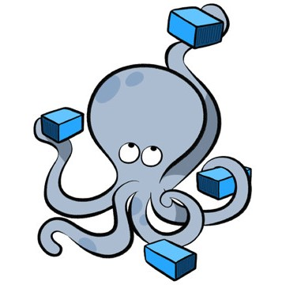
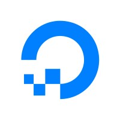

<h1 align="center">Hi 👋, I'm Enrique Cocom</h1>

  

-------------

- 👀 I'm interested in programming and cybersecurity
- 👨‍💻 I'm currently Student of Computer Systems Engineering.
- 💞️ I’m looking to collaborate on Google, Microsoft o Facebook.
- 📫 How to reach me enriquecocomcanul@gmail.com
- 🧙‍♂️✨TEAM #IAWizards.

## Skills

### Frameworks FrontEnd :package:
| | |
| ---------------------------------------------------------------------------------------------------| ---------------------------------------------------------------------------------------------------- |

### Frameworks BackEnd :package:
|  |  |  |
|-----------------------------------------------------------------------|----------------------------------------------------------------------------------------------|-----------------------------------------------------------------------------------------------------|

### Programming Languages :computer:

|  | | |  |
|-------------------------------------------|------------------------------------|-----------------------------------|-------|

### Tools SRE 🛠️
|  |  |  |  |
|---------------------------------------------------------------------------------------|-------------------------------------------------------------------------|------------------------ |------------------------------------------------------------------|

### Databases :floppy_disk:

| |  |  |  |
| -------------------------------------------------------------------------- | ---------------------------------------------------------------------------- | -------------------------------------------------------------------------- |---------------------------------------------------------|

### other technologies  :hammer_and_wrench:
|  |  |  |
| ---------------------------------------------------------------------------- | -------------------------------------------------------------------------- | -------------------------------- |

### Cloud :cloud:

|  |  |  |
| ---------------------------------------------------------------------------- | --------------------------------------------------------------------------|-----------------------------------|

<h3 align="left">Connect with me:  </h3>

 

<h3 align="left">Languages and Tools:</h3>

 
 

  

------------------------

<!--
**EnriqueCocom/enriquecocom** is a ✨ _special_ ✨ repository because its `README.md` (this file) appears on your GitHub profile.
-->

